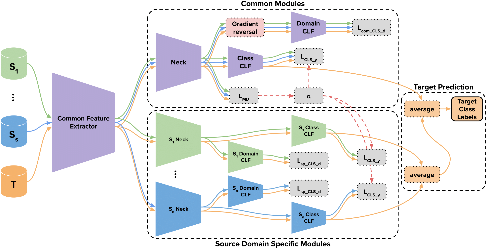

# WMSSDA: Weighted Multi-Source Supervised Domain Adaptation

This repository contains the source code used for the pre-print ["Deep Multi-Source Supervised Domain Adaptation with Class Imbalance"](https://www.researchsquare.com/article/rs-3160713/v1).

Deep multi-source domain adaptation is based on deep neural networks and exploits knowledge from several source domains to improve predictions on a target domain.
In this paper we are especially interested in the application of domain adaptation in a context of limited data and class imbalance.
We propose a new multi-source supervised domain adaptation method that is able to transfer both shared knowledge across all source domains and source domain specific knowledge towards a target domain.
Attention weights are computed during training and are applied to balance each source domain specific classification component during inference on target domain, largely limiting the impact of negative transfer.
We show that our method competes and even outperforms other state-of-the-art domain adaptation methods on extensive experiments on both image benchmark datasets and a real-world tabular medical dataset.
We conduct statistical analysis to better assess the results our experimental results.

Figure 1. Visual representation of our method WMSSDA, common modules appear in purple, *i*-th source domain specific modules appear in the same color as the *i*-th associated source domain.

## Usage

* To reproduce our experiments you can execute the 3 bash scripts named run\_\*.sh. Those launch command lines of the form:
> python exp\_\*.py -m "method\_name" -e nb\_epochs -b nb\_batches -r nb\_runs -l learning\_rate

* There are 3 example notebooks named \*\_WMSSDA\_beta that show the usage of our method on each tested multi-source dataset.

## Data

* Digits: Our utils.dataset script downloads automatically MNIST, MNIST-M, SYN and USPS in the data/digits folder, SVHN data needs to be manually downloaded from [here](http://ufldl.stanford.edu/housenumbers), choosing cropped digits, rename files to svhn\_train.mat and svhn\_test.mat.

* DomainNet: Cleaned data needs to be downloaded from [here](http://ai.bu.edu/M3SDA/#dataset) and extracted in the data/domainnet folder, the notebook named preprocess\_domainnet needs to be executed to obtain the necessary preprocessing.

* Covid: The csv dataset needs to be downloaded from [here](https://www.kaggle.com/datasets/meirnizri/covid19-dataset) and put in the data/covid folder, the notebook named preprocess\_covid needs to be executed to obtain the necessary preprocessing.
